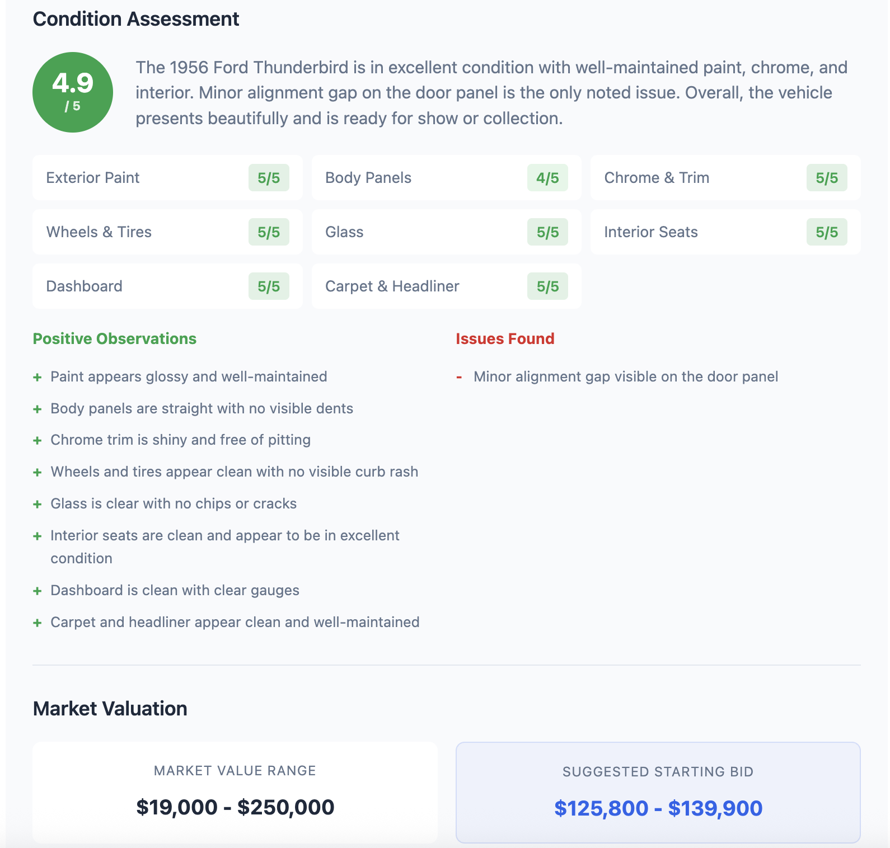

# Classic Car Analysis Pipeline

An AI-powered pipeline for analyzing classic car videos -- from YouTube URLs or uploaded files -- that transcribes audio, visually inspects extracted frames for condition, looks up current market values, and suggests a starting bid price range.

## Project Overview

This system processes videos of classic cars (typically auction walkarounds or dealer presentations) and combines **three signal sources** to produce a comprehensive analysis:

- **What was said** -- Whisper transcribes the audio; AI agents extract make/model/year, history, features, and verbal condition notes
- **What the camera shows** -- GPT-4o inspects extracted video frames, scoring 8 condition areas (1-5 scale), flagging damage and highlights with supporting screenshot evidence
- **What the market says** -- Web search pulls current prices from Hagerty, Bring a Trailer, Hemmings, and KBB; the condition score then adjusts the market range into a suggested starting bid

The pipeline runs in five phases:

1. **Transcription** -- Whisper extracts speech-to-text with word-level timestamps
2. **Transcript Analysis** -- Multiple AI agents identify vehicle details and generate a written summary
3. **Vision Condition Analysis** -- GPT-4o examines ~10 video frames, rates condition areas, and links each observation to the frame where it was most clearly visible
4. **Market Valuation** -- OpenAI web search looks up current blue book and recent auction values
5. **Bid Price Calculation** -- Condition score adjusts the market value to produce a suggested starting bid range

## Architecture

```
┌─────────────────┐     ┌─────────────────┐     ┌──────────────────────────┐
│   Frontend      │────▶│   FastAPI       │────▶│   Background Workers     │
│   (HTML/JS)     │     │   Backend       │     │                          │
└─────────────────┘     └─────────────────┘     │  Download                │
                               │                │  ▼                       │
                               ▼                │  Video Processing        │
                        ┌─────────────────┐     │  (audio + frames)        │
                        │   SQLite DB     │     │  ▼                       │
                        │   (Jobs)        │     │  Transcript Analysis     │
                        └─────────────────┘     │  (multi-agent)           │
                                                │  ▼                       │
                                                │  Vision Analysis (GPT-4o)│
                                                │  ▼                       │
                                                │  Market Valuation        │
                                                │  (web search + bid calc) │
                                                └──────────────────────────┘
```

## Quick Start

### Using Docker (Recommended)

1. Clone the repository:
```bash
git clone https://github.com/wolfgangjblack/Classic-Car-Analysis.git
cd Classic-Car-Analysis
```

2. Create your `.env` file:
```bash
cp .env.example .env
# Edit .env and add your OPENAI_API_KEY
```

3. Start the services:
```bash
docker-compose up --build
```

4. Access the application:
   - Frontend: http://localhost:3000
   - API: http://localhost:8000
   - API Docs: http://localhost:8000/docs

### Manual Installation

1. Install system dependencies:
```bash
# macOS
brew install ffmpeg

# Ubuntu/Debian
sudo apt-get install ffmpeg
```

2. Install Python dependencies:
```bash
cd backend
pip install -r requirements.txt
```

3. Set up environment variables:
```bash
export OPENAI_API_KEY="your-api-key-here"
```

4. Run the API server:
```bash
cd backend
uvicorn app.main:app --reload
```

## Usage

### Web Interface

1. Open http://localhost:3000 in your browser
2. Either drag-and-drop a video file or enter a YouTube URL
3. Watch the progress through each phase (download, transcription, analysis, vision inspection, valuation)
4. View the full results: transcript summary, condition assessment with evidence screenshots, market value range, and suggested starting bid
5. Download: use the **Download** dropdown to export a Summary PDF (with evidence images and captions), processing logs, or both
6. If a job fails, click **Retry** to reprocess it



### CLI

The CLI provides direct access to all processing functionality:

```bash
cd backend

# Process a local video file
python -m cli.main process /path/to/video.mp4

# Process with custom output directory
python -m cli.main process video.mp4 --output ./my-output

# Download and process a YouTube video
python -m cli.main download "https://youtube.com/watch?v=..."

# Generate summary from existing transcript
python -m cli.main summarize /path/to/transcript.json

# List available transcripts
python -m cli.main list-transcripts

# Show configuration
python -m cli.main config
```

### API Endpoints

| Method | Endpoint | Description |
|--------|----------|-------------|
| POST | `/api/videos/upload` | Upload a video file |
| POST | `/api/videos/url` | Submit a YouTube/video URL |
| GET | `/api/jobs` | List all jobs |
| GET | `/api/jobs/{id}` | Get job status and details |
| GET | `/api/jobs/{id}/summary` | Get job summary, condition, valuation |
| GET | `/api/jobs/{id}/logs` | Get processing logs |
| GET | `/api/jobs/{id}/evidence/{filename}` | Serve an evidence frame image |
| POST | `/api/jobs/{id}/retry` | Retry a failed job |
| DELETE | `/api/jobs/{id}` | Delete/cancel a job |
| GET | `/api/costs` | Get cost report |
| GET | `/health` | Health check |

## Project Structure

```
classic-car-analysis/
├── backend/
│   ├── app/
│   │   ├── api/              # FastAPI route handlers
│   │   ├── core/             # Core processing logic
│   │   │   ├── agents.py     # AI agent definitions
│   │   │   ├── nlp_utils.py  # NLP utilities
│   │   │   ├── valuation.py  # Market value lookup & bid calculation
│   │   │   ├── video_classes.py  # Data models
│   │   │   ├── video_pipeline.py # Video processing
│   │   │   └── vision_analyzer.py # GPT-4o frame condition analysis
│   │   ├── models/           # Database & Pydantic schemas
│   │   ├── services/         # Service layer
│   │   │   ├── agent_service.py    # Transcript analysis orchestration
│   │   │   ├── valuation_service.py # Market valuation wrapper
│   │   │   ├── video_service.py    # Video processing wrapper
│   │   │   └── vision_service.py   # Vision analysis wrapper
│   │   ├── workers/          # Background task handlers
│   │   ├── config.py         # Configuration
│   │   └── main.py           # FastAPI application
│   ├── cli/                  # Command-line interface
│   ├── Dockerfile
│   └── requirements.txt
├── frontend/
│   ├── index.html
│   ├── styles.css
│   ├── app.js
│   ├── nginx.conf
│   └── Dockerfile
├── agent_prompts/            # AI agent system prompts
├── data/                     # Processing data (created at runtime)
├── docker-compose.yml
├── .env.example
└── README.md
```

## Configuration

Configuration is managed through environment variables. See `.env.example` for all available options:

| Variable | Description | Default |
|----------|-------------|---------|
| `OPENAI_API_KEY` | OpenAI API key (required) | - |
| `WHISPER_MODEL_SIZE` | Whisper model size | `medium` |
| `FRAME_EXTRACT_INTERVAL` | Seconds between frame extractions | `5` |
| `VISION_MODEL` | OpenAI model for vision analysis | `gpt-4o` |
| `MAX_VISION_FRAMES` | Max frames sent to vision model | `10` |
| `MAX_UPLOAD_SIZE_MB` | Maximum upload file size | `500` |

## AI Agents

The system uses specialized AI agents to extract information:

- **BasicAgent**: Extracts make, model, year, and package information
- **HistoryAgent**: Extracts mileage, owners, accident history, maintenance
- **ConditionAgent**: Extracts exterior, interior, and mechanical condition (from transcript)
- **SummaryAgent**: Generates comprehensive vehicle summaries
- **VisionConditionAgent**: GPT-4o vision analysis of extracted video frames for paint, body, chrome, interior condition scoring (1-5 scale per area)

## Vision Analysis & Market Valuation

After transcript analysis, the pipeline runs two additional phases:

### Vision Condition Analysis

Selects up to 10 evenly-spaced frames from the video, encodes them as base64 JPEG, and sends them in a single multi-image request to GPT-4o. The model examines every image, rates 8 condition areas, and links each observation back to the specific frame where it was spotted. These **evidence frames** are copied to a per-job directory and served to the frontend as clickable thumbnails alongside each observation, so a reviewer can see exactly what the model is referring to.

| Area | Weight | What the model looks for |
|------|--------|--------------------------|
| Exterior Paint | 1.5x | Fading, oxidation, overspray, color match |
| Body Panels | 1.5x | Dents, dings, ripples, filler, panel gaps |
| Chrome & Trim | 1.5x | Pitting, peeling, dullness, missing pieces |
| Wheels & Tires | 1.5x | Curb rash, tire age/tread, wheel finish |
| Glass | 1.0x | Chips, cracks, cloudiness, seal condition |
| Interior Seats | 1.0x | Tears, wear, staining, bolster wear |
| Dashboard | 1.0x | Cracks, warping, gauge clarity |
| Carpet & Headliner | 1.0x | Sagging, staining, wear patterns |

Each area is scored 1-5 (1=poor, 5=excellent). The overall score is a weighted average with exterior areas weighted 1.5x (more important for auction presentation). The model produces running lists of positive and negative observations, each backed by the specific video frame that shows it.

### Market Valuation & Bid Calculation

Uses OpenAI's Responses API with built-in `web_search` to query current market values from Hagerty, Bring a Trailer, Hemmings, and Kelley Blue Book. The response is parsed for a price range, and the condition score is used to calculate a starting bid:

| Condition Score | Bid Range (% of market value) |
|-----------------|-------------------------------|
| 5 (Excellent) | 95-105% |
| 4 (Good) | 80-95% |
| 3 (Fair) | 60-80% |
| 2 (Below Avg) | 40-60% |
| 1 (Poor) | 25-45% |

Values between integer scores are linearly interpolated.

## Cost Tracking

The system tracks API usage costs for each processed video. View costs via:
- Web UI: Displayed in summary cards
- CLI: Shown after processing
- API: `GET /api/costs`

## Development

### Running Tests

```bash
cd backend
pytest
```

### Code Style

```bash
# Format code
black backend/

# Type checking
mypy backend/
```

## Future Development

- [x] Pricing model integration (market valuation via web search)
- [x] Bidding recommendation system (condition-adjusted bid range)
- [x] Enhanced visual analysis of vehicle condition (GPT-4o vision)
- [x] Evidence-linked observations with screenshot support
- [x] PDF report export with evidence images and captions
- [x] Job retry on failure
- [ ] Dealer guidance for video capture
- [ ] VIN and CarFax API integration
- [ ] Multi-language support

## License

This project is licensed under the terms included in the LICENSE file.

## Contributing

Contributions are welcome! Please feel free to submit a Pull Request.
